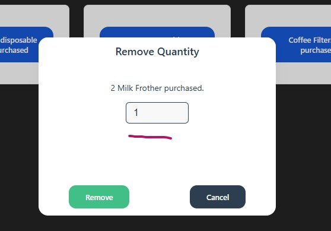
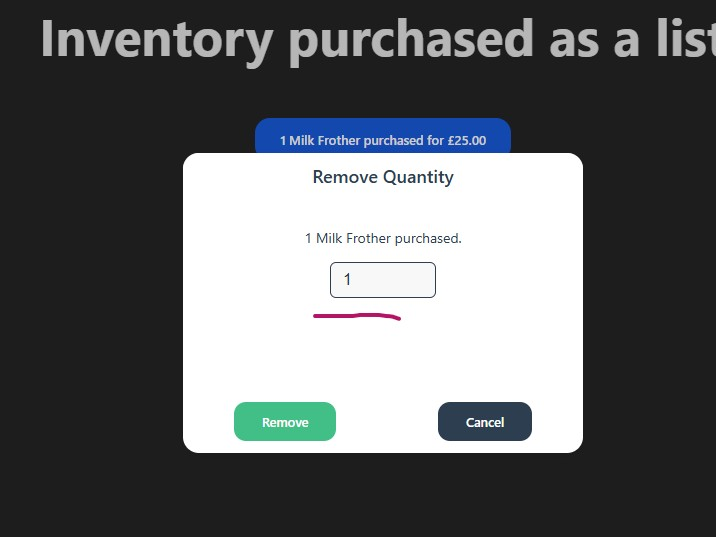

## Caveats and Limitations

This test framework was written over a weekend, with not much time to spare.

As such, these tests do not consider:

- Parallel test runs.
- Browsers other than Chrome.
- More than one worker.
- Mocking of API requests.
- More test coverage for both the UI and API tests.
  
## Potential Issues (Frontend)

The automation of updating and removing the quantity was rendered difficult due to both the value in the following field being prefilled, and there being no easy selector to allow for the updating of that value:

The tests use a workaround, but the person responsible for their creation is well aware that this is not the optimal solution.

